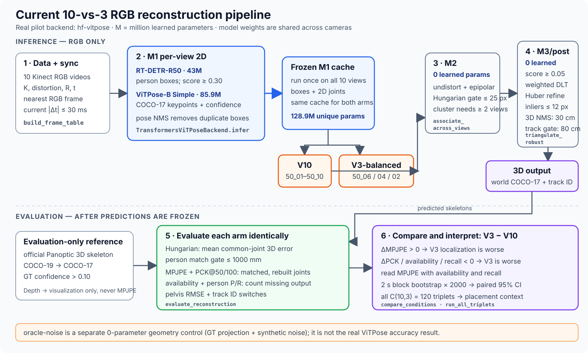

# CMU Panoptic：10 台与 3 台 RGB 相机的人体 3D Skeleton Reconstruction Study

Last updated: 2026-07-25.

## 1. Study decision

本 study 回答一个明确问题：

> 在保持 2D pose model、cross-view association、calibration、同步帧和
> triangulation algorithm 不变时，将输入从 10 个 calibrated RGB views
> 减少到 3 个 views，会让多人 3D skeleton reconstruction accuracy 下降多少？

### Quick glossary（先读）

| Keyword | Meaning in this study | Concrete example |
|---|---|---|
| **View / camera view** | 一台相机在一个同步时刻提供的一张 RGB image。 | V10 有 10 views；V3-balanced 只允许 3 views。 |
| **M1** | 对每个 view 独立做人检测和 2D pose estimation。它不知道跨相机的 person identity。 | RT-DETR 找人框；ViTPose 输出 COCO-17 joints。 |
| **Detection / person detection** | M1 在**一张图中**提出的一个匿名 person hypothesis：一个 bounding box、17 个 2D joints 和 scores。 | `Cam1 detection #0` 只表示 Cam1 中的第 0 个结果，不表示某个已知的人。 |
| **Bounding box / bbox** | detector 认为包含一个人的矩形区域，也是 ViTPose 的 pose crop。 | `[x1, y1, x2, y2]`。 |
| **Joint / keypoint** | 有固定语义的身体点，例如 left wrist 或 right hip。 | 每个 joint 保存 `(x, y, score)`；M3 后变成 `(X, Y, Z)`。 |
| **Confidence / score** | 模型对 detection 或 joint 的相对可信度；用于 filtering 和 weighting，不应理解为已校准的正确概率。 | M3 只使用 joint score `>= 0.05`。 |
| **Local detection ID** | 只在一个 camera/frame 内区分 detections 的临时编号；不同相机中的同一人通常编号不同。 | `Cam1 #0` 可能对应 `Cam2 #1`。 |
| **Pose NMS** | 在同一 view 内删除同一个人产生的重复 2D poses，保留较强结果。 | 当前用 normalized joint distance `< 0.12` 判断 duplicate。 |
| **Calibration / undistortion** | `K, distCoef, R, t` 描述相机成像和世界位置；undistortion 去除镜头畸变后再做几何计算。 | 把 raw 2D pixel 转成 calibrated viewing ray。 |
| **M2 / cross-view association** | 判断同一时刻、不同 cameras 的哪些 detections 属于同一个 physical person。 | `Cam1 #0 ↔ Cam2 #1 ↔ Cam3 #0`。 |
| **Person cluster** | M2 建立的临时 detection group；每个 camera 最多贡献一个 detection，且尚未有 GT identity。 | `[Cam1 #0, Cam2 #1, Cam3 #0]` 将生成一个 3D skeleton。 |
| **Epipolar distance** | 一个 camera 的 joint 根据 calibration 在另一个 camera 中对应一条 epipolar line；candidate joint 到该线的 pixel distance 是几何一致性误差。 | 距离越小，两个 2D poses 越可能是同一个人。 |
| **Matching cost** | 算法为一个 possible match 计算的“不相似度”；越小越好。当前 M2 使用两个 detections 中所有可靠的同名 joints，以 joint confidence 加权后取 epipolar distance 的 weighted median。 | Cluster A 与 `Cam2 #1` 的 cost 可能是 `6 px`。 |
| **Gate / threshold** | 接受结果所允许的最大误差；超过 gate 就拒绝，不是 learned parameter。 | M2 gate `25 px`；M3 reprojection gate `12 px`；evaluation person gate `1000 mm`。 |
| **Hungarian matching** | 在一个 cost matrix 中寻找最小总 cost 的 one-to-one assignment。一个 cluster 与当前 camera detection 都最多使用一次。 | 防止 Cluster A 和 B 同时认领 `Cam2 #1`。 |
| **M3 / triangulation** | 对一个 person cluster 中同名 joints 的 calibrated rays 求 3D intersection。 | 至少两个 views 的 left wrist 才能重建 3D left wrist。 |
| **Reprojection error / inlier** | 把 estimated 3D joint 投影回相机后，与原 2D joint 的距离；在 gate 内的 observation 是 inlier。 | 当前 M3 inlier gate 为 `12 px`。 |
| **3D NMS** | M2 split cluster 可能产生重复 3D people；按 multi-view support 保留较可靠 skeleton，并抑制空间上很近的 duplicate。 | 当前 torso-distance gate 为 `30 cm`。 |
| **Track ID** | reconstruction 后用于跨时间连接同一个人的 persistent ID；不同于 local detection ID。 | pelvis tracker 使用 `80 cm` assignment gate。 |
| **GT / ground truth** | official Panoptic 3D skeleton，只在 predictions freeze 后用于 evaluation，不进入 M1–M3 inference。 | Panoptic COCO-19 GT 被映射为与 ViTPose 一致的 COCO-17。 |
| **Eligible GT joint** | GT confidence 高于 evaluation threshold、因此进入 metric denominator 的 joint。 | 当前为 GT confidence `> 0.10`。 |
| **MPJPE** | matched people 中成功重建的 eligible joints 的平均 3D distance error；越低越好。 | `38 mm` 表示这些 joints 平均离 GT `38 mm`。 |
| **PCK@50 / PCK@100** | 上述 evaluated joints 中误差不超过 `50/100 mm` 的比例；越高越好。 | PCK@100 `0.93` 表示 93% 的 evaluated joints 在 100 mm 内。 |
| **Joint availability** | 成功重建的 eligible GT joints ÷ 全部 eligible GT joints；越高越好。 | 必须与 MPJPE 一起读，避免漏掉难 joints 后 error 看似更低。 |

主要方法为：

```text
Kinect RGB（只作为 monocular RGB camera）
  -> person detector
  -> ViTPose COCO-17 keypoints
  -> M1 per-view 2D joints
  -> M2 cross-view same-person association
  -> robust confidence-weighted triangulation
  -> world-coordinate 3D skeleton
```

Kinect depth 不得进入上述 inference pipeline。十路 depth 只在预测结果已经
冻结以后，由独立 evaluation process 读取，用来生成 fused point cloud 和
几何可视化。

### Primary comparison

| Condition | RGB input | Depth input | Cameras |
|---|---:|---:|---|
| `V10` | Yes | No | `50_01`–`50_10` |
| `V3-balanced` | Yes | No | `50_06`, `50_04`, `50_02` |

从已下载的 `160906_band1` calibration 计算，primary 3-camera subset 的三个
azimuth gaps 约为 `112.0° / 104.2° / 143.8°`。这是一个预先根据 camera
geometry 选择的 balanced triplet，不允许根据 test-set skeleton error 再修改。

### Secondary comparison

枚举所有

\[
\binom{10}{3}=120
\]

个 3-camera subsets。报告所有 triplets 的 error distribution，并研究 camera
geometry，而不是只比较一个可能被人为挑选得特别好或特别差的 triplet。

### Current 10-vs-3 pipeline at a glance

下图只画当前已经跑通的 real-RGB implementation（`hf-vitpose` backend）。
M1 在十路 RGB 上只运行一次；V10 与 V3 从同一份 frozen cache 选择不同 cameras，
之后使用完全相同的 M2、M3、tracking 和 evaluation code。



当前 learned models 为
[RT-DETR-R50](https://huggingface.co/PekingU/rtdetr_r50vd_coco_o365)
（约 `43M` parameters，找 person boxes）和
[ViTPose-B Simple](https://huggingface.co/usyd-community/vitpose-base-simple)
（`85.9M` parameters，在每个 box 内输出 COCO-17 2D joints）。合计约
`128.9M` unique learned parameters；同一组 weights 在所有 cameras 上复用，
不是 V10 乘十份。M2/M3、3D NMS、tracking 和 evaluation 都是
`0 learned parameters` 的 geometry/optimization algorithms。

读图时只需记住：

- comparison 定义为 `Δ = V3 − V10`：`ΔMPJPE > 0` 或
  `ΔPCK / Δavailability / Δrecall < 0` 都表示 V3 更差；
- MPJPE/PCK 只覆盖成功匹配且成功重建的 eligible joints，必须与 joint
  availability 和 person recall 一起读，避免“漏掉难例后 error 反而更低”；
- 95% CI 来自 paired `2 s` block bootstrap（`2000` repeats）；120 triplets
  用来判断差异来自 camera count 还是 particular placement；
- official 3D skeleton、GT identity 和 Kinect depth 都不进入 inference；
  depth 只用于 prediction freeze 后的 point-cloud visualization。

### Implemented pipeline

本 study 已实现为可运行的 Python package：

```text
src/panoptic_10v3/
  io.py             # calibration, GT, univ_time frame table, RGB frame access
  m1.py             # MMPose ViTPose-B adapter + labeled oracle-noise control
  m2.py             # distortion-aware epipolar association
  geometry.py       # projection, weighted DLT, robust reprojection refinement
  reconstruct.py    # M3 reconstruction + 3D duplicate NMS + persistent track ID
  evaluate.py       # matching, MPJPE/PCK/availability/M2, block bootstrap, 120 triplets
  stage_evaluate.py # evaluation-only M1 projection metrics and M2 identity scoring
  depth_eval.py     # isolated evaluation-only ten-depth fusion
  visualize.py      # calibration audit, summary figures, HTML viewer, MP4
  cli.py            # reproducible commands
```

一条命令运行 geometry control pilot：

```bash
PANOPTIC_PYTHON=/Users/zjendex/.conda/envs/GAN/bin/python \
  scripts/run_cmu_panoptic_10v3.sh
```

或显式运行：

```bash
MPLCONFIGDIR=/tmp/panoptic_mpl \
XDG_CACHE_HOME=/tmp/panoptic_cache \
PYTHONPATH=src \
/Users/zjendex/.conda/envs/GAN/bin/python \
  -m panoptic_10v3.cli run-study \
  --sequence-dir data/cmu_panoptic/160906_band1 \
  --output-dir artifacts/cmu_panoptic_10v3/oracle_noise_pilot \
  --backend oracle-noise \
  --stride 5 \
  --max-frames 120 \
  --triplet-max-frames 60
```

`oracle-noise` 是 GT projection 加固定 5 px noise/missingness 的 geometry
control，不是 ViTPose result。真实 M1 使用官方 MMPose model alias：

```bash
scripts/install_vitpose_env.sh

PYTHONPATH=src python -m panoptic_10v3.cli m1 \
  --sequence-dir data/cmu_panoptic/160906_band1 \
  --frame-table artifacts/cmu_panoptic_10v3/vitpose/frame_table.jsonl \
  --output artifacts/cmu_panoptic_10v3/vitpose/m1_2d.jsonl \
  --backend vitpose
```

`MMPoseViTPoseBackend` 固定选择 `vitpose-b`，对应
`td-hm_ViTPose-base-simple_8xb64-210e_coco-256x192` 和 MMPose 的 person
detector。真实 ViTPose run 必须保留独立 output directory，不能覆盖
`oracle_noise_pilot`。

macOS 上如果 OpenMMLab compiled ops 不易安装，可使用已经实现的
Transformers backend。它遵循 Hugging Face 官方 ViTPose workflow，固定
`PekingU/rtdetr_r50vd_coco_o365` person detector 和
`usyd-community/vitpose-base-simple`：

```bash
scripts/install_hf_vitpose_env.sh

PYTHONPATH=src .venv-vitpose/bin/python -m panoptic_10v3.cli m1 \
  --sequence-dir data/cmu_panoptic/160906_band1 \
  --frame-table artifacts/cmu_panoptic_10v3/vitpose/frame_table.jsonl \
  --output artifacts/cmu_panoptic_10v3/vitpose/m1_2d.jsonl \
  --backend hf-vitpose \
  --device full-mps \
  --resume-m1
```

MMPose 与 Transformers backend 的 detector/model combination 不相同，因此
两者不能混在一个 primary comparison 中。选择一个 backend 后要冻结 M1 cache，
V10 与全部 V3 都从该 cache subselect。

在 Apple Silicon 上，`full-mps` 会把 RT-DETR 和 ViTPose 都放到 Metal GPU，
保持 FP32。RT-DETR 内部唯一需要 `float64` 的 sinusoidal position embedding
在 CPU 上生成后传回 MPS；如果某个 MPS operator 失败，runtime 自动按
`full-mps -> hybrid (CPU detector + MPS pose) -> CPU` 回退，并把 mode、耗时、
fallback reason 和 MPS memory 写入 manifest。`--resume-m1` 使用
`m1_2d.partial.jsonl`：每个 camera-frame flush、每 10 条 `fsync`，完成后才
atomic rename 为 `m1_2d.jsonl`。

完整 Transformers pilot：

```bash
MPLCONFIGDIR=/tmp/panoptic_mpl \
XDG_CACHE_HOME=/tmp/panoptic_cache \
PYTHONPATH=src \
.venv-vitpose/bin/python -m panoptic_10v3.cli run-study \
  --sequence-dir data/cmu_panoptic/160906_band1 \
  --output-dir artifacts/cmu_panoptic_10v3/hf_vitpose_pilot20 \
  --backend hf-vitpose \
  --stride 10 \
  --max-frames 20 \
  --triplet-max-frames 20 \
  --viewer-max-frames 20 \
  --video-fps 6
```

后续重跑 M2/M3、evaluation 和 visualization 时使用 `--reuse-m1`。CLI 会先验证
M1 cache 的 `HD frame + camera + source frame + backend` 是否完全匹配，然后
才允许复用。当前 RT-DETR 与 ViTPose model revisions 已固定，并在 manifest
中保存 prediction SHA-256。

完整 `59.1 s × 10 Hz` primary V10/V3 run 使用：

```bash
scripts/run_cmu_panoptic_full59s_mps.sh
```

脚本默认 `stride=3` 和 `591` 个 GT candidate times；可通过
`PANOPTIC_MAX_FRAMES` 在 held-out scene 上限制同一 protocol 的运行长度。
实际 primary run
要求十路 RGB 都在 `±30 ms` gate 内，因此保留 `575 synchronized frames`
（HD 213–1938，57.56 s）和 `5750 camera-frames`；其余 16 个 candidate
不以 missing/late camera 填充，避免把 “V10” 变成可变 view-count 条件。脚本
跳过 long-run all-120-triplets secondary analysis，先完成 RGB-only inference
和 evaluation，再建立 evaluation-only colored RGB-D cache，最后生成
`575-frame` interactive HTML 与 `10 fps` comparison MP4。

### Held-out scene checks（2026-07-25）

使用完全相同的 frozen RT-DETR、ViTPose、M2/M3 parameters 和
`V3-balanced = 50_06 / 50_04 / 50_02`，另外运行两个各 300 frames、10 Hz
的场景。RGB-only inference 完成后才读取 Kinect depth 生成彩色 surface
reference：

| Sequence | Scene | V10 MPJPE | V3 MPJPE | Δ V3−V10 | V10 / V3 availability | 95% paired CI |
|---|---|---:|---:|---:|---:|---:|
| `171026_pose3` | single-person motion range | 17.98 mm | 26.77 mm | +8.80 mm | 100.0% / 98.3% | +7.64 to +10.90 mm |
| `160224_haggling1` | close three-person interaction | 21.81 mm | 32.32 mm | +10.51 mm | 100.0% / 86.0% | +6.30 to +13.71 mm |

两条 held-out runs 的 `track_id_switches` 均为 0。`haggling1` 的 V3
availability 明显下降，说明近距离多人遮挡时只读 MPJPE 会低估 3-view
degradation；必须同时报告 availability、person precision 和 person recall。

已生成的 30 秒 outputs：

```text
artifacts/cmu_panoptic_10v3/hf_vitpose_pose3_30s/visuals/
  comparison.mp4
  interactive_comparison.html

artifacts/cmu_panoptic_10v3/hf_vitpose_haggling1_30s/visuals/
  comparison.mp4
  interactive_comparison.html
```

两条 MP4 均为 `1920×720 / 10 FPS / 300 frames`。`pose3` 每帧有 9–10
个 accepted depth nodes；`haggling1` 每帧有 8–10 个，且两者都没有
zero-cloud frames。

MP4 与 HTML 的 world-view projection 使用 screen `+Y`，使 Panoptic
world-coordinate 人物保持正立。旧版 screen `−Y` projection 会把人物上下
颠倒；这只影响 visualization，不改变 M1–M3 或 metrics。

三栏同时显示 world-aligned ground grid：Panoptic floor 为 `Y = 0 cm`，
minor spacing 为 `50 cm`，加粗 major spacing 为 `1 m`。Grid 覆盖以当前
人物区域为中心的固定 `6 m × 6 m` ground patch，避免异常 skeleton outlier
把 grid 扩大成过密的全场网格。

### Current implementation validation

在 `160906_band1` 上已完成：

- 120 个 common frames，采样间隔 5 HD frames；
- 10 路实际 RGB frame 的 calibration projection audit；
- V10 与 pre-registered V3-balanced paired reconstruction；
- 60 frames × 全部 120 个 camera triplets；
- 2-second block bootstrap；
- evaluation-only 10-depth fused PLY 和 skeleton overlay；
- portable interactive HTML、summary PNG、triplet geometry PNG 和 120-frame MP4；
- synthetic geometry test、real calibration round-trip test、sync-table test 和
  depth-import isolation test。

当前 5 px `oracle-noise` control 得到：

| Metric | V10 | V3-balanced | V3 − V10 |
|---|---:|---:|---:|
| MPJPE | 7.74 mm | 16.10 mm | +8.36 mm |
| PCK@50 | 100.00% | 99.30% | −0.70 pp |
| Joint availability | 100.00% | 98.78% | −1.22 pp |
| Person recall | 100.00% | 99.72% | −0.28 pp |
| M2 pairwise F1 | 99.77% | 99.71% | −0.06 pp |

Paired MPJPE delta 的 2-second block-bootstrap 95% CI 为
`[+8.04, +8.73] mm`。Balanced triplet 在 120 组中按 MPJPE 排第 `33/120`；
60-frame control 的 best/median/worst 分别为
`14.98 / 16.94 / 26.02 mm`。

这些数值只证明 synchronization、calibration、M2/M3 和 evaluation code 已经
端到端工作。它们不能回答真实 ViTPose accuracy，也不能直接作为三台 ZED X
的最终 accuracy claim。

### Preliminary real ViTPose pilot

真实 RGB-only pipeline 已在同一 sequence 的 20 个 synchronized frames 上
运行，包含 `200 camera-frames` 和 `593 frozen person detections`。模型固定为：

```text
detector:
  PekingU/rtdetr_r50vd_coco_o365
  revision 457857cec8ac28ddede40ecee9eed2beca321af8
pose:
  usyd-community/vitpose-base-simple
  revision a93ac0c67e0b7e2c55287d21d4c460c8f3c54d45
```

M1 使用 official 3D joints 的 calibrated 2D projections 做 evaluation-only
matching，结果为：

| M1 metric | 10-camera aggregate |
|---|---:|
| Person precision / recall | 99.66% / 98.50% |
| Mean 2D joint error | 18.50 px |
| Joint availability | 99.18% |
| PCK@0.10 bbox scale | 86.77% |

`50_02` 的 person recall 为 85%，其余九台在这个短片中为 100%；这是 camera
layout analysis 不能只看 baseline 的一个例子。

End-to-end 3D 结果：

| Metric | V10 | V3-balanced | V3 − V10 |
|---|---:|---:|---:|
| MPJPE | 19.85 mm | 38.04 mm | +18.19 mm |
| PCK@50 | 94.87% | 79.86% | −15.01 pp |
| PCK@100 | 99.20% | 92.73% | −6.48 pp |
| Joint availability | 100.00% | 81.44% | −18.56 pp |
| Person precision | 100.00% | 100.00% | 0 pp |
| Person recall | 100.00% | 98.33% | −1.67 pp |
| Pelvis trajectory RMSE | 42.64 mm | 87.38 mm | +44.75 mm |
| Track ID switches | 0 | 0 | 0 |

20-frame paired 2-second block bootstrap 的 MPJPE delta 95% CI 为
`[+13.25, +25.38] mm`，但只有 4 temporal blocks，不能当作 final confidence
interval。

M2 identity 只在 prediction freeze 后由 M1-to-GT assignments 打分；GT ID
没有进入 association 或 triangulation：

| M2 metric | V10 | V3-balanced |
|---|---:|---:|
| Pairwise precision | 97.20% | 99.30% |
| Pairwise recall | 90.15% | 87.65% |
| Pairwise F1 | 93.54% | 93.11% |
| Cluster purity | 98.58% | 99.38% |
| Cluster completeness | 93.98% | 93.89% |

M2 split clusters 会产生同一个人的重复 3D skeleton。实现使用 development-only
的 `30 cm torso-distance 3D NMS`，按 triangulation view support 保留较可靠的
候选。它把本 pilot 的 V10 predictions 从 69 个降到正确的 60 个，同时 MPJPE
基本不变，并将 ID switches 从 4 降到 0。Close-contact held-out sequence
仍需加入 RGB appearance embedding 来检验该 gate 是否会错误合并两个人。

### Full common-window ViTPose result

以下先记录 2026-07-25 的 original torso-priority M2 baseline；2026-07-26
full-pose M2 update 的完整六组重跑结果见本节末的 updated report。

M4 Pro full-MPS run 覆盖 575 个 all-ten-view synchronized frames、57.56 s、
5750 camera-frames 和 16,785 frozen person detections。RT-DETR 与 ViTPose
均使用 FP32 MPS，runtime 没有 fallback；M1 inference（含 model load）耗时
约 999 s。

| Metric | V10 | V3-balanced | V3 − V10 |
|---|---:|---:|---:|
| MPJPE | 18.57 mm | 34.04 mm | +15.47 mm |
| PCK@50 | 94.42% | 81.51% | −12.91 pp |
| PCK@100 | 98.80% | 93.67% | −5.13 pp |
| Joint availability | 99.99% | 92.13% | −7.86 pp |
| Person precision | 99.65% | 99.94% | +0.29 pp |
| Person recall | 100.00% | 99.94% | −0.06 pp |
| Pelvis trajectory RMSE | 52.20 mm | 93.93 mm | +41.73 mm |
| Track ID switches | 0 | 1 | +1 |

Paired 2-second block-bootstrap 使用 29 个 temporal blocks；V3 − V10 MPJPE
mean delta 为 `+15.71 mm`，95% CI 为 `[+14.59, +17.17] mm`。因此在本
Panoptic sequence、固定 camera placement、固定 M1/M2/M3 implementation 下，
三路相对十路有清晰且稳定的 accuracy/availability loss；这仍不是 ZED X
deployment accuracy。

Long-run M1 aggregate：person precision / recall 为
`99.92% / 97.22%`，mean / median joint error 为
`17.53 / 8.06 px`，joint availability 为 `97.29%`。

Original M2 audit 暴露了一个重要工程问题：V10 pairwise F1 只有 `89.40%`，而 V3 为
`98.95%`；V10 wrong-merge 和 split-person frame rates 都约为 46%。V10 最终
3D accuracy 仍很好，是因为多视角冗余和 post-triangulation 3D NMS 消除了大量
重复 cluster，但这不能掩盖 original M2 本身的问题。

2026-07-26 采用最小修改：不再在 torso 可见时丢弃 limbs，而是让所有可靠
COCO-17 joints 共同参与相同的 confidence-weighted epipolar median。Frozen
M1 的 band1 V10 重跑中，M2 pairwise F1 从 `89.40%` 提升到 `99.82%`，
wrong-person merge-cluster rate 从 `46.27%` 降到 `0%`，MPJPE 从
`18.57 mm` 降到 `18.16 mm`。完整 ablation、三条 sequences 的 V10/V3
重跑和限制见
[`artifacts/cmu_panoptic_10v3/comprehensive_report_2026-07-26/report.html`](../artifacts/cmu_panoptic_10v3/comprehensive_report_2026-07-26/report.html)。

575 帧 evaluation-only RGB-D QA：544 帧接受 10 个 depth nodes，31 帧接受
9 个；没有 cloud 被 suppression。每帧保存 20k voxelized points。Depth-node
temporal span median 为 `28.24 ms`，152 帧超过 30 ms，viewer/MP4 会明确
显示 warning；这些 cloud 不用于 MPJPE 或 inference。

GT confidence sensitivity：

| GT threshold | V10 MPJPE | V3 MPJPE | V10 / V3 availability |
|---:|---:|---:|---:|
| `> 0.1` | 19.85 mm | 38.04 mm | 100.00% / 81.44% |
| `> 0.2` | 17.14 mm | 34.87 mm | 96.78% / 80.57% |
| `> 0.5` | 12.73 mm | 23.02 mm | 85.90% / 77.35% |

真实 M1 cache 的全部 120 个 triplets（20 frames each）中，
best/median/worst MPJPE 为 `28.23 / 57.37 / 227.66 mm`。Pre-registered
balanced triplet 为 `38.04 mm`，排名 `30/120`。这说明 camera placement 与
per-camera M1 quality 都很重要。

按照 section 5 的 provisional engineering thresholds，V3 的 MPJPE delta
勉强低于 20 mm，但 PCK@100 与 availability drop 均超过 5 pp，所以此
20-frame pilot **不通过 provisional acceptance gate**。这不是 ZED X 结论；
必须完成更长时间、held-out sequences 和 ZED-domain M1 measurements。

## 2. Why this dataset fits the question

[CMU Panoptic 3D PointCloud DB](http://domedb.perception.cs.cmu.edu/ptclouddb.html)
提供：

- 10 台 Kinect v2 RGB-D sensors；
- 十路 Kinect RGB videos 和 depth streams；
- Kinect RGB/depth calibration；
- Panoptic world calibration；
- RGB、depth 和 HD timeline 的 synchronization tables；
- 由十路 depth 合并的 point-cloud workflow；
- 与其他 Panoptic RGB cameras 和 3D skeleton 共用的 world coordinate system。

官方说明也指出：

- 多台 Kinect 不能做到完全相同的 exposure time；
- point cloud 使用目标时间前后约 `±15 ms` 的 depth frames 合并；
- 快速运动时 fused cloud 可能出现 temporal misalignment；
- 不能按各 Kinect video 的相同 frame number 直接对齐，必须使用 sync table。

这使它很适合模拟目前 ZED X roadmap 的 M1–M3，但不能完全替代 ZED X
validation：

| Property | CMU Kinect color | Current ZED X |
|---|---|---|
| Resolution | 1920×1080 | 1920×1200 per eye |
| Stored video | H.264 MP4 | side-by-side elementary H.265 |
| View count used here | 10 or 3 monocular RGB views | 3 wide-baseline left views |
| Stereo pair | Not used | Each ZED has left/right pair |
| Array synchronization | timestamp/sync-table aligned | P2P-LAN timestamps |
| Main use in this study | M1, M2, M3 benchmark | Target deployment |

本 study 因而测量的是“多视角数量与布局对 RGB-only pose triangulation 的影响”，
不是 ZED stereo rectification 或 ZED depth accuracy。

相关项目定义见
[Three-ZED-X Human Mesh Roadmap](zedx_multiview_human_mesh_roadmap.md)。

## 3. Ground-truth hierarchy and the depth rule

### 3.1 Primary joint reference: official Panoptic 3D skeleton

Primary skeleton metrics 使用官方：

```text
hdPose3d_stage1_coco19/body3DScene_XXXXXXXX.json
```

原因是该文件直接提供 world-coordinate joint centers、person ID 和 joint
confidence，适合计算 MPJPE。

ViTPose 的 COCO-17 joints 与 Panoptic COCO19 的映射如下：

| COCO-17 | Panoptic COCO19 |
|---|---|
| nose | `1 Nose` |
| left/right eye | `15 / 17` |
| left/right ear | `16 / 18` |
| left/right shoulder | `3 / 9` |
| left/right elbow | `4 / 10` |
| left/right wrist | `5 / 11` |
| left/right hip | `6 / 12` |
| left/right knee | `7 / 13` |
| left/right ankle | `8 / 14` |

Panoptic `Neck` 和 `BodyCenter` 不进入 primary COCO-17 MPJPE；可以在
trajectory analysis 中把左右髋中点定义为 pelvis。

Primary evaluation 只统计 Panoptic joint confidence `> 0.1` 的 GT joints。
同时必须报告 `> 0.2` 和 `> 0.5` 的 sensitivity analysis，防止结论只由一个
confidence threshold 决定。

### 3.2 Secondary surface reference: ten-depth fused point cloud

十路 depth fusion 是人体表面，而 skeleton joint 多数位于人体内部。因此：

> 禁止把 `distance(joint, nearest point-cloud point)` 当成 MPJPE。

正确的 depth-based secondary checks 为：

1. 在 world frame 中叠加 GT、V10、V3 skeleton 和 fused cloud，进行
   qualitative geometry inspection。
2. 使用固定 limb radii 的 skeleton capsules，计算
   `cloud-to-capsule surface distance`；V10 和 V3 必须使用同一组 radii。
3. 计算 point-cloud coverage、95th percentile surface residual 和 outlier
   fraction。
4. 由静态 floor points 拟合 floor plane，检查 ankle/foot 的 penetration、
   hovering 和 trajectory。
5. 如果后续加入 SMPL，再计算 depth-cloud-to-SMPL symmetric Chamfer
   distance；这属于 M5/M6 extension，不应混入本 study 的 primary conclusion。

### 3.3 No-depth leakage contract

Inference 与 evaluation 必须物理分离：

```text
RGB inference process may read:
  calibration_*.json
  synctables_*.json
  ksynctables_*.json
  kinectVideos/*.mp4

RGB inference process may not read:
  kinect_shared_depth/**
  generated point clouds
  depth-derived masks, boxes, IDs, visibility or confidence

Evaluation process may read:
  frozen RGB predictions
  official 3D skeleton
  depth streams and fused point clouds
```

Depth 不得用于：

- person detection 或 bounding box；
- ViTPose input；
- M2 person association；
- view selection；
- 2D confidence correction；
- missing-joint filling；
- triangulation；
- hyperparameter tuning；
- 决定某个 3-camera triplet 是否被保留。

在 evaluation 前保存 prediction manifest、config hash 和 output checksum。

## 4. Dataset and download plan

### 4.1 Downloaded pilot

Pilot sequence：

```text
160906_band1
```

选择原因：

- 10 Kinect RGB + 10 Kinect depth 均存在；
- 官方 HD COCO19 3D skeleton 存在；
- Kinect 有效段约 70 秒，适合作为第一个 end-to-end pilot；
- common skeleton window 中有 IDs `0, 1, 2`，可以测试多人 M2；
- 相比 `160422_haggling1`，下载规模明显较小。

本地目录：

```text
data/cmu_panoptic/160906_band1/
```

当前 verified input：

- 10 个 H.264 videos；
- 每个 video 为 1920×1080、30 FPS；
- 每路约 69.6–71.5 秒、2089–2145 frames；
- `calibration_160906_band1.json`；
- `kcalibration_160906_band1.json`；
- `synctables_160906_band1.json`；
- `ksynctables_160906_band1.json`；
- `hdPose3d_stage1_coco19.tar`；
- 十路 RGB 合计约 0.557 GB；
- 十路 depth 完整大小约 9.3 GB；
- 每个 depth file 的 byte length 已验证为
  `512 × 424 × 2 × depth_sync_entry_count`；
- RGB video frame counts 已逐路与 color sync-table entry counts 对齐；
- 没有残留的 `.part` files。

Pilot 的 common HD-index inspection 得到：

- 1860 个 skeleton JSON files 落入初始 Kinect overlap interval；
- 1772 frames 含 3 个 bodies；
- 88 frames 没有有效 bodies，不能默默加入 joint-error denominator。

最终 frame eligibility 必须通过 `univ_time` join 重新生成，不能仅依赖上述
index 范围。

### 4.2 Reproducible downloader

官方 toolbox 已放在：

```text
third_party/panoptic-toolbox/
```

项目 downloader：

```bash
scripts/download_cmu_panoptic_study.sh \
  --sequence 160906_band1 \
  --scope metadata \
  --jobs 4

scripts/download_cmu_panoptic_study.sh \
  --sequence 160906_band1 \
  --scope rgb \
  --jobs 5

scripts/download_cmu_panoptic_study.sh \
  --sequence 160906_band1 \
  --scope depth \
  --jobs 10

tar -xf \
  data/cmu_panoptic/160906_band1/hdPose3d_stage1_coco19.tar \
  -C data/cmu_panoptic/160906_band1
```

`*.part` 是可续传文件；重新执行相同命令会继续下载。`data/` 与
`third_party/` 已加入 `.gitignore`。

如果 evaluation 只覆盖较短的 frozen `frame_table`，不必下载整段
4–5 分钟 raw depth。下列 bounded downloader 先计算十个 Kinect nodes
实际会访问的最大 `depth_sync_position`，再生成可续传的
`depthdata.window.dat` prefix：

```bash
.venv-vitpose/bin/python scripts/download_cmu_panoptic_depth_window.py \
  --sequence-dir data/cmu_panoptic/171026_pose3 \
  --frame-table artifacts/cmu_panoptic_10v3/hf_vitpose_pose3_30s/frame_table.jsonl \
  --jobs 4

PANOPTIC_MAX_FRAMES=300 \
PANOPTIC_DEPTH_FILENAME=depthdata.window.dat \
scripts/run_cmu_panoptic_full59s_mps.sh \
  data/cmu_panoptic/171026_pose3 \
  artifacts/cmu_panoptic_10v3/hf_vitpose_pose3_30s
```

每个 prefix 以完整 `512 × 424 × uint16` frame 为边界，并在 manifest 中记录
maximum sync position 和 required bytes。它足以精确重放该 frame table 的
point cloud，但不能冒充完整 sequence depth stream。

数据只允许 academic/non-commercial research 使用，引用要求见
[Panoptic Toolbox](https://github.com/CMU-Perceptual-Computing-Lab/panoptic-toolbox)。

### 4.3 Full study sequence panel

Pilot 通过后再扩展，避免先下载大量不能使用的数据。

| Role | Sequence | Purpose |
|---|---|---|
| Development/pilot | `160906_band1` | 3-person M1/M2/M3 integration |
| Single-person check | `171026_cello3` | isolate M1 + geometry; instrument occlusion |
| Motion range | `171026_pose3` | large joint-angle and full-body motion |
| Close interaction | `160224_haggling1` | M2, occlusion and similar spatial proximity |
| Cluttered scene | `170407_office2` | background clutter and partial occlusion |

阈值只能在 development sequence 上选择。其余 sequences 保持 held out，直到
pipeline 与 config hash 冻结。

## 5. Research questions and hypotheses

### RQ1: Overall accuracy

V3 相对 V10 的 world-coordinate MPJPE 增加多少毫米？

Primary effect：

\[
\Delta \mathrm{MPJPE}
=
\mathrm{MPJPE}_{V3}
-
\mathrm{MPJPE}_{V10}
\]

同时报告 relative change：

\[
100
\times
\frac{\mathrm{MPJPE}_{V3}-\mathrm{MPJPE}_{V10}}
{\mathrm{MPJPE}_{V10}}
\]

### RQ2: Which joints fail

预期 wrists、ankles 和被遮挡一侧的 joints 对 view reduction 更敏感。必须按
joint、person、sequence、occlusion level 和 triangulation angle 分层报告。

### RQ3: M1, M2 or triangulation

3-view degradation 有多少来自：

- M1 2D localization；
- M2 cross-view association；
- M3 camera geometry/redundancy？

### RQ4: Does camera placement matter more than camera count

在所有 120 个 triplets 中，minimum ray angle、azimuth coverage、joint
visibility 和 reconstruction error 的关系是什么？

### Initial practical threshold

在获得真实 ZED downstream tolerance 前，先使用：

- `ΔMPJPE <= 20 mm`；
- `PCK@100mm` 下降不超过 `5 percentage points`；
- reconstructed-joint availability 下降不超过 `5 percentage points`。

这是 engineering decision threshold，不是已知事实；最终应由 ZED X 应用对
trajectory/mesh 的误差容忍度替换。

## 6. Controlled experimental protocol

### 6.1 The paired design

先对十路 RGB 各运行一次 M1，并缓存所有 2D detections/keypoints。V10 与
所有 V3 conditions 从同一个 M1 cache 选择不同 camera columns：

```text
same target time
same source RGB frame per camera
same ViTPose output
same calibration
same M2/M3 code and thresholds
different allowed camera set only
```

这样可消除重复 model inference 的 nondeterminism，并形成严格 paired
comparison。

### 6.2 Synchronization

以 Panoptic HD `univ_time` 为 target timeline：

1. 根据 `ksynctables` 为每台 Kinect color camera 找 nearest frame。
2. 应用 toolbox 中定义的 color timing correction。
3. 保存每个 camera/frame 的 signed `delta_t_ms`。
4. 当前 implementation 的 common-frame gate 要求 V10 所有 RGB views 的
   `|delta_t| <= 30 ms`。
5. 另以更严格的 `16.7 ms` threshold 做 synchronization sensitivity analysis。
6. V3 必须使用 V10 common-frame set，不能因为只要求三台相机而获得更多、
   更容易的 frames。

Depth point cloud 使用独立 depth timestamp matching；每个使用的 depth frame
必须满足官方约 `±15 ms` fusion window，并报告十路 depth 的实际 temporal
span。快速运动且 span 过大的 cloud 要标记为 unreliable，不用于 quantitative
surface metric。

### 6.3 Calibration convention

Panoptic calibration 使用：

\[
X_{camera}=R X_{world}+t
\]

\[
x \sim K X_{camera}
\]

相机中心：

\[
C_{world}=-R^{T}t
\]

Panoptic world position 单位为 centimeters；所有 metrics 在读取后立即转换成
millimeters。

在正式 inference 前必须通过：

- GT skeleton reprojection overlay；
- camera center/frustum 3D plot；
- distortion/undistortion round-trip；
- at least 20 manually inspected synchronized frames。

### 6.4 Image distortion

ViTPose 在原始 Kinect color image 上运行。进入 triangulation 前：

1. 保留 raw pixel coordinate 供 2D visualization；
2. 使用对应 `K` 与 `distCoef` 把 keypoints 转为 undistorted normalized rays；
3. 用 `[R|t]` triangulate；
4. 画回原始图像时重新使用 distortion model。

不要把 distortion coefficients 丢弃，也不要把 raw pixels 与
undistorted projection matrix 混用。

## 7. Pipeline specification

本节描述 final-study target。当前 executable subset 以 section 1 的 pipeline
graph 为准；例如 RGB appearance association、ray-angle/covariance output
仍是待实现项。

### 7.1 M1: single-view person and 2D pose

Primary model：

- fixed RGB-only person detector；
- [ViTPose](https://github.com/ViTAE-Transformer/ViTPose) COCO-17；
- recommended primary checkpoint: `ViTPose-B`, 256×192 input；
- implementation through [MMPose](https://mmpose.readthedocs.io/)；
- no Panoptic fine-tuning in the primary experiment。

必须保存：

```text
sequence_id
target_hd_index
target_univ_time
camera_id
source_rgb_frame_index
rgb_delta_t_ms
detection_id
bbox_xyxy
detection_score
keypoints_xy[17,2]
keypoint_score[17]
model/config/checkpoint hashes
```

Primary run 使用 detector-produced bounding boxes。GT boxes 只能用于单独的
`oracle-box` ablation，不能替代 primary detection misses。

M1 metrics：

- person detection recall；
- mean/median 2D joint error in pixels；
- normalized joint error；
- PCK@0.05、PCK@0.10、PCK@0.20 of bounding-box size；
- per-joint error；
- error vs ViTPose confidence；
- failure rate by camera and person。

2D reference 由 official 3D GT 经对应 calibrated camera 投影产生。被遮挡与
低 GT confidence joints 必须分开报告。

### 7.2 M2: same-person association across views

Primary M2 不使用 GT IDs。推荐：

1. 用 undistorted epipolar distance 建立跨相机 candidate edges；
2. 加入 2D pose compatibility；
3. 加入 RGB crop appearance embedding，但不能用人脸身份识别；
4. 从 camera pairs 生成 short 3D hypotheses；
5. 用 reprojection consistency 和 robust clustering 合并为 multi-view person；
6. 禁止同一 camera 的两个 detections 进入同一 cluster。

所有 association gates 在 development split 冻结，V10 与 V3 使用完全相同值。

M2 metrics：

- pairwise association precision/recall/F1；
- cluster purity；
- cluster completeness；
- wrong-person merge rate；
- split-person rate；
- unmatched-person rate；
- temporal ID switch count，作为 secondary trajectory metric。

### 7.3 M3: robust triangulation

每个 joint：

1. 至少需要两个 associated views；
2. confidence-weighted DLT initialization；
3. RANSAC 或 pair-hypothesis outlier rejection；
4. nonlinear reprojection refinement；
5. Huber/Cauchy robust loss；
6. reject behind-camera solutions；
7. record ray intersection angle、views used、reprojection residual；
8. 从 image-point uncertainty 传播 3D covariance。

Primary evaluation 不加入 temporal smoothing，因为 smoothing 会掩盖 camera
count 的即时影响。One-Euro/Kalman/spline smoothing 只作为 trajectory
secondary experiment，并且 V10/V3 使用相同参数。

## 8. Ablations that separate M1, M2 and M3

只做一个 end-to-end number 无法解释误差来源。需要三个层级：

| Ablation | 2D joints | Person association | Purpose |
|---|---|---|---|
| `A-geometry` | GT projections + sampled ViTPose-like pixel noise | GT ID | camera geometry only |
| `B-oracle-ID` | ViTPose predictions | GT ID | M1 + M3 |
| `C-end-to-end` | ViTPose predictions | predicted M2 | M1 + M2 + M3 |

`A-geometry` 的 pixel-noise distribution 必须从 development set 的真实 ViTPose
2D residuals拟合，然后用固定 random seeds 重复至少 100 次。

误差分解：

```text
B - A ≈ M1 localization/domain contribution
C - B ≈ M2 association contribution
V3 - V10 within each level ≈ camera-count/geometry sensitivity
```

这不是严格的 causal decomposition，但比只报告一个 end-to-end MPJPE 更容易
诊断。

## 9. Evaluation metrics

### 9.1 Person matching

每帧使用 Hungarian matching 把 predicted 3D persons 匹配到 GT：

- cost：共同 valid joints 的 world MPJPE；
- current implementation gate：1000 mm；
- unmatched predictions 为 false positives；
- unmatched GT persons 为 false negatives。

不能只对成功匹配的 easy cases 报 MPJPE。

### 9.2 Primary 3D metrics

| Metric | Meaning |
|---|---|
| Absolute world MPJPE (mm) | Primary skeleton accuracy |
| Median joint error (mm) | Robust central error |
| PCK3D@50 / @100 mm | Fraction of joints within threshold |
| AP@50 / @100 / @150 mm | Person-level pose detection quality |
| Reconstruction availability | Fraction of eligible GT joints reconstructed |
| Person recall / precision | Missing and hallucinated people |
| Per-joint MPJPE | Which body parts degrade |

Root-relative MPJPE 与 PA-MPJPE 可以报告，但不能替代 absolute world MPJPE，
因为它们会隐藏 world translation、orientation 或 scale failures。

### 9.3 Trajectory metrics

虽然 study 重点是 skeleton reconstruction，也应输出：

- pelvis absolute trajectory error；
- velocity error；
- acceleration error；
- frame-to-frame bone-length variation；
- jerk/jitter；
- ID switches；
- longest continuous track。

### 9.4 Operational metrics

- GPU memory；
- M1 images/second；
- end-to-end frames/second；
- M2 and M3 runtime；
- V10/V3 latency ratio；
- proportion of joints using 2, 3, 4+ views。

Accuracy comparison 与 runtime comparison 分开呈现。

## 10. Statistics

### 10.1 Paired effect

同一 `sequence/frame/person/joint` 上计算：

\[
d_i=e_{V3,i}-e_{V10,i}
\]

报告：

- mean and median paired difference；
- relative percentage degradation；
- 95% confidence interval；
- per-joint effect；
- reconstructed availability difference。

### 10.2 Temporal dependence

视频 frames 不是 independent samples。禁止把每个 frame 当独立样本做普通
t-test。使用：

- 2-second moving blocks；
- cluster/block bootstrap；
- resampling unit 包含 `sequence -> person -> temporal block`；
- at least 2000 bootstrap replicates；
- fixed random seed。

Pilot 只有一个 sequence，所以其 CI 只能描述该场景，不能声称跨场景
generalization。最终结论来自 held-out multi-sequence panel。

### 10.3 Missing predictions

同时给出两张表：

1. `matched-only localization accuracy`；
2. `detection/reconstruction coverage`。

不能通过丢弃 V3 失败 joints 获得更低 MPJPE。可另给一个 capped error
(`500 mm` for missing) 作为 sensitivity score，但必须清楚标注。

### 10.4 All-triplet analysis

对 120 triplets 计算：

- minimum/median triangulation angle；
- camera-center azimuth/elevation coverage；
- GT projected in-frame coverage；
- M2 association F1；
- MPJPE；
- missing-joint rate。

绘制 geometry score 与 error 的 relationship，并把 primary triplet 在图中
单独标出。

## 11. Transfer back to the three-ZED-X roadmap

Panoptic V3 结果不能直接宣称等于 ZED X accuracy。需要把本 study 变成一个
可接受 ZED M1/M2 measurements 的 transfer model：

1. 在每台 ZED X 的 rectified left view 上运行完全相同的 detector +
   ViTPose checkpoint。
2. 人工标注一个小型 ZED validation set 的 2D COCO-17 joints、occlusion 和
   person boxes。
3. 计算 ZED 的 per-joint 2D residual、confidence calibration、detection
   recall 和 occlusion failure rate。
4. 用 ZED measured residual distribution 替换 `A-geometry` 中从 Panoptic
   学到的 pixel noise。
5. 一旦 `T_world_left` 可用，在真实 ZED camera centers/rays 上运行同一个
   Monte Carlo triangulation。
6. 对多人 ZED clips 测量 M2 association F1 和 wrong-person merge rate，并与
   Panoptic V3-balanced 对照。

这样可以把误差拆成：

```text
Panoptic V10 -> Panoptic V3:
  loss caused by reducing view count and redundancy

Panoptic V3 -> ZED V3 with measured M1 noise:
  loss caused by image/domain/compression and actual camera geometry

ZED synthetic/oracle association -> ZED end-to-end:
  loss caused by M2 association
```

在 ZED validation set 可用前，Panoptic study 是 algorithm/geometry benchmark，
不是最终 deployment accuracy claim。

## 12. Visualization specification

### 12.1 Time-synchronized interactive viewer

推荐使用 [Rerun](https://rerun.io/) 生成 `.rrd`：

```text
Left panel:
  10 synchronized RGB views
  ViTPose joints and confidence
  person ID color
  selected V3 cameras highlighted

Three locked 3D panels:
  the same fused RGB-colored point cloud in GT, V10, and V3
  official GT skeleton
  V10 skeleton
  V3 skeleton
  camera centers/frustums
  pelvis trajectories
  joint error vectors
  triangulation uncertainty ellipsoids

Bottom timeline:
  frame/time
  RGB sync skew per camera
  MPJPE V10/V3
  person count
  M2 failures
```

Viewer requirements：

- V10、V3、GT 可独立 toggle；
- 2D 与 3D 共用同一个 target time；
- stable person color across views/time；
- 3D axes、camera、scale 和 viewpoint 锁定；
- 不允许 V10 与 V3 分别 auto-scale；
- default `near body` 显示距任一 GT limb segment 不超过 `35 cm` 的 surface；
- `full scene` toggle 同时切换三栏到同一个全局 scene bounds；
- point opacity 和 point size 可交互调整；
- 点击 3D joint 可以定位十个 2D observations；
- association error 和 missing joint 有明确颜色/符号；
- depth cloud temporal span 超标时显示 warning。

### 12.2 Portable HTML result viewer

用 Plotly 输出：

```text
reports/cmu_panoptic_10v3/interactive_comparison.html
```

内容：

- camera layout top view；
- GT/V10/V3 3D overlay；
- frame slider；
- per-joint error heatmap；
- V10-vs-V3 paired scatter；
- MPJPE ECDF；
- all-120-triplets geometry-vs-error plot。

Point cloud 必须 voxel-downsample 后嵌入，避免 HTML 过大。

当前实现先用 `2 cm` voxel 对每个 HD time 的十路 RGB-D cloud 做 deterministic
XYZ/RGB average，并限制 cache 为 `20k points/frame`。HTML 再以
`0.1 cm int16 XYZ + uint8 RGB + near-body flag` 打包，每帧最多 `5k points`；
这保留自然 RGB color，同时让完整 591-frame viewer 可离线打开。Point cloud
永远是 surface reference，不取代 official Panoptic skeleton GT。

### 12.3 Review video

生成一个固定相机视角的 MP4：

```text
reports/cmu_panoptic_10v3/videos/
  band1_gt_10view_3view_overlay.mp4
```

画面必须同时显示：

- GT、V10、V3 skeleton；
- 当前 absolute MPJPE；
- views actually used per joint；
- IDs；
- sync skew；
- failure reason。

### 12.4 Summary figures

至少包含：

1. `paired_error_ecdf.png`
2. `per_joint_delta_mpjpe.png`
3. `error_over_time.png`
4. `camera_triplet_geometry_map.png`
5. `association_confusion.png`
6. `availability_vs_accuracy.png`
7. `pointcloud_overlay_examples.png`

必须展示 best、median 和 worst cases，而不是只展示视觉上最成功的 frames。

## 13. Output layout

```text
data/cmu_panoptic/160906_band1/
  calibration_160906_band1.json
  kcalibration_160906_band1.json
  synctables_160906_band1.json
  ksynctables_160906_band1.json
  kinectVideos/
  kinect_shared_depth/
  hdPose3d_stage1_coco19/

artifacts/cmu_panoptic_10v3/
  oracle_noise_pilot/
    frame_table.jsonl
    frame_table.summary.json
    m1_2d.jsonl
    m3_v10.jsonl
    m3_v3_balanced.jsonl
    evaluation_v10/{summary.json,per_frame.jsonl}
    evaluation_v3/{summary.json,per_frame.jsonl}
    comparison.json
    all_120_triplets.csv
    manifest.json
    depth_eval/
      index.jsonl
      clouds/hd_*.npz
    visuals/
      calibration_audit.png
      summary.png
      triplet_geometry.png
      interactive_comparison.html
      comparison.mp4
```

当前使用 streaming JSONL，以便在最小 Python environment 中运行且便于逐行
检查。后续如果 sequence panel 扩大，可增加 Parquet export，但 Parquet 不是
正确性依赖。

## 14. Execution milestones

### S0 — Data and calibration gate

- [x] Clone official Panoptic toolbox.
- [x] Download pilot calibration and sync metadata.
- [x] Download and decode-check ten Kinect RGB videos.
- [x] Download and extract official COCO19 skeleton archive.
- [x] Finish and byte-length-check ten depth streams.
- [x] Reproject GT onto all ten RGB cameras and save a ten-panel audit.
- [x] Verify world units, `R/t` convention and distortion by real-data round trip.
- [x] Build common `univ_time` frame table.

Exit criterion：20 manually inspected frames have correct camera, person, frame and
projection alignment; median GT reprojection disagreement is explained and recorded.

### S1 — M1 gate

- [x] Implement the MMPose `vitpose-b` adapter and raw-prediction cache.
- [x] Implement a clearly labeled oracle-noise geometry-control backend.
- [x] Run detector + ViTPose on ten RGB streams for the 20-frame real pilot.
- [x] Run 575 all-ten-view common frames with full-MPS and resumable M1 cache.
- [x] Produce per-camera M1 metrics from calibrated GT projections.
- [ ] Produce per-camera ViTPose image overlays.
- [ ] Calibrate keypoint confidence against 2D residual.

Exit criterion：no systematic left/right swap, frame shift, distortion error or camera-ID
swap。

### S2 — M2 gate

- [x] Implement calibrated epipolar association with Hungarian assignment.
- [x] Compare predicted association with embedded oracle identity in the control run.
- [x] Evaluate real M2 with post-freeze M1-to-GT assignments.
- [x] Add post-triangulation duplicate-person 3D NMS.
- [x] Visualize multi-person frame-level reconstruction and failure behavior.
- [ ] Add the planned appearance embedding before the real ViTPose final run.

Exit criterion：M2 errors are explicitly counted; no GT identity enters primary inference。

### S3 — M3 and 10-vs-3 gate

- [x] Run V10 on the geometry control.
- [x] Run pre-registered V3-balanced on the geometry control.
- [x] Run all 120 triplets from the same cached M1 file.
- [x] Repeat V10/V3/all-120 with frozen ViTPose M1 on the 20-frame pilot.
- [x] Repeat the primary V10/V3 configuration on the full common pilot window.
- [ ] Repeat the frozen configuration on held-out sequences.
- [ ] Complete A/B/C ablations on the real M1 cache.

Exit criterion：paired metrics reproduce from one config and one prediction manifest。

### S4 — Depth evaluation gate

- [x] Generate time-aligned ten-depth fused clouds in Python.
- [x] Generate RGB-colored, voxelized clouds for all 575 primary frames.
- [x] Verify cloud alignment against GT in X/Z, X/Y and Z/Y projections.
- [x] Implement descriptive bone-axis capsule coverage.
- [ ] Add floor-plane and SMPL surface metrics after M5/M6 exist.

Exit criterion：depth directory is absent from the inference process access log。

### S5 — Visualization and report

- [x] Export a dependency-free interactive 3D HTML viewer.
- [x] Export synchronized comparison MP4.
- [x] Add the same colored cloud to GT/V10/V3 with near-body/full-scene modes.
- [x] Export calibration, M1/M2, metric and all-triplet geometry figures.
- [ ] Export optional Rerun viewer.
- [x] Produce the full-window ViTPose statistical report and engineering decision.

Exit criterion：a reviewer can identify why any selected V3 frame is better/worse than V10
without reading source code。

## 15. Risks and controls

| Risk | Control |
|---|---|
| Kinect frames are not directly frame-synchronized | Join by `univ_time`, log per-view skew |
| Fast motion smears fused point cloud | Record depth temporal span; exclude unreliable clouds from quantitative surface metrics |
| Official 3D skeleton has low-confidence/errors | Confidence mask, manual audit, threshold sensitivity |
| 3-camera subset cherry-picking | Pre-register balanced triplet and report all 120 |
| MPJPE ignores missing people | Report precision/recall and availability separately |
| Point-cloud surface misused as joint GT | Use official skeleton for MPJPE; capsules/SMPL for surface metrics |
| 10 views get different preprocessing | Cache M1 once and subset the same predictions |
| Temporal smoothing hides view-count effects | No smoothing in primary frame-level result |
| Panoptic domain differs from ZED X | Treat as algorithm benchmark; repeat final protocol on ZED recordings |
| Camera count and camera placement are confounded | All-triplet geometry analysis |

## 16. Final result table template

| Metric | V10 | V3-balanced | Difference | 95% CI |
|---|---:|---:|---:|---:|
| Absolute MPJPE (mm) |  |  |  |  |
| Median joint error (mm) |  |  |  |  |
| PCK3D@50 (%) |  |  |  |  |
| PCK3D@100 (%) |  |  |  |  |
| Person recall (%) |  |  |  |  |
| Reconstructed joints (%) |  |  |  |  |
| M2 association F1 (%) |  |  |  |  |
| Pelvis trajectory RMSE (mm) |  |  |  |  |
| Runtime (ms/frame) |  |  |  |  |

最终 conclusion 必须分成三句话：

1. `3 views cost X mm / Y% accuracy relative to 10 views`；
2. `the degradation is primarily caused by M1, M2, or geometry`；
3. `the selected 3-camera geometry is/is not sufficient for the ZED X pilot`。

## 17. References

- [CMU Panoptic 3D PointCloud DB](http://domedb.perception.cs.cmu.edu/ptclouddb.html)
- [CMU Panoptic Toolbox and download scripts](https://github.com/CMU-Perceptual-Computing-Lab/panoptic-toolbox)
- [Panoptic calibration and data tools](https://domedb.perception.cs.cmu.edu/develop/tools.html)
- [Panoptic Studio paper](https://arxiv.org/abs/1612.03153)
- [ViTPose](https://github.com/ViTAE-Transformer/ViTPose)
- [MMPose](https://mmpose.readthedocs.io/)
- [MMPose inference guide](https://github.com/open-mmlab/mmpose/blob/main/docs/en/user_guides/inference.md)
- [Hugging Face ViTPose documentation](https://huggingface.co/docs/transformers/model_doc/vitpose)
- [Three-ZED-X Human Mesh Roadmap](zedx_multiview_human_mesh_roadmap.md)
