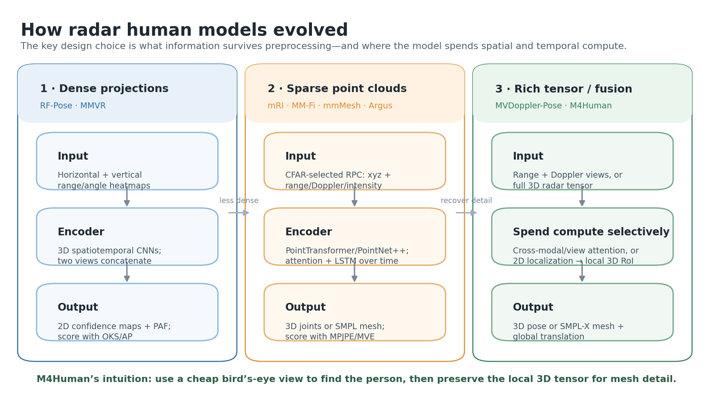
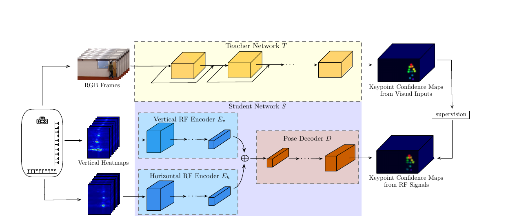
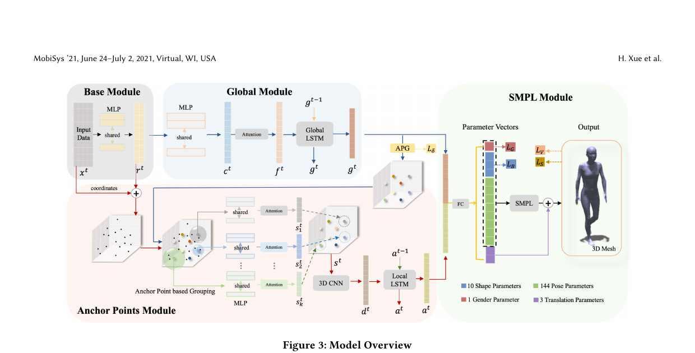
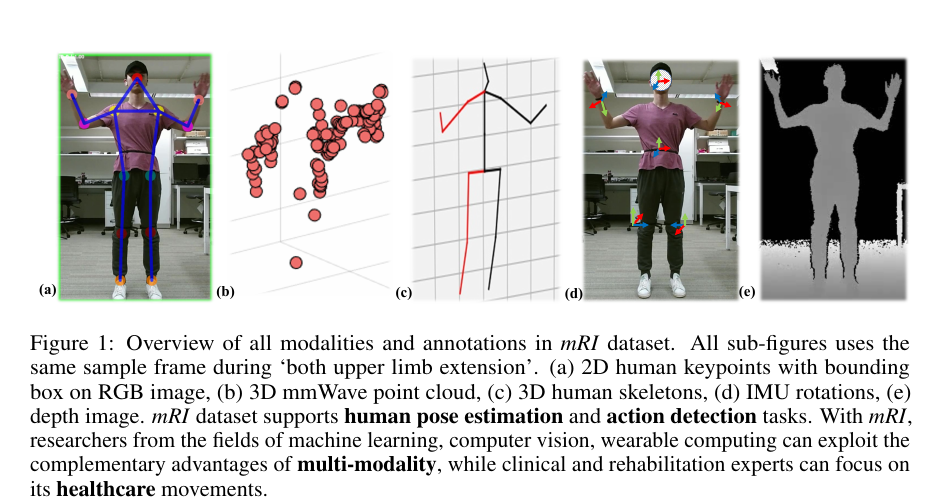
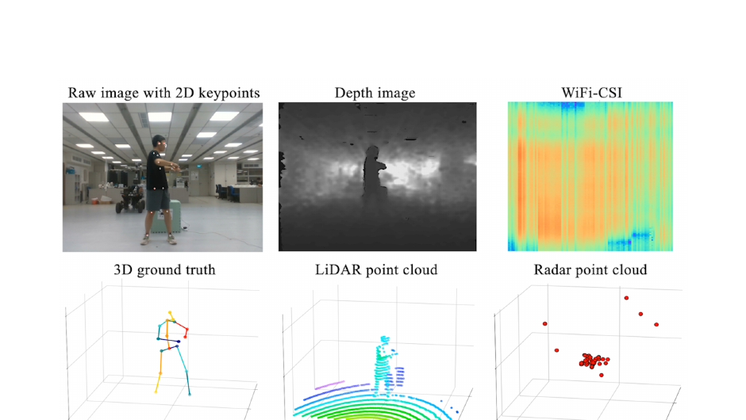
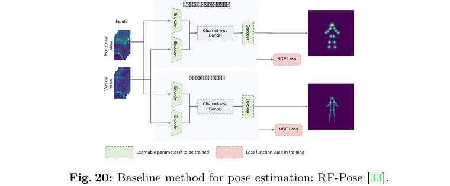
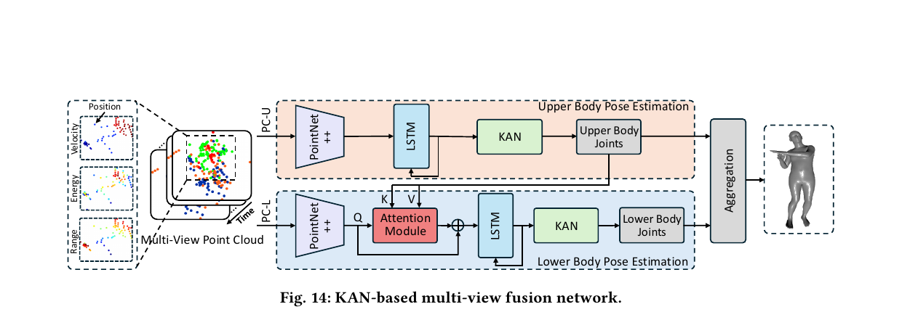
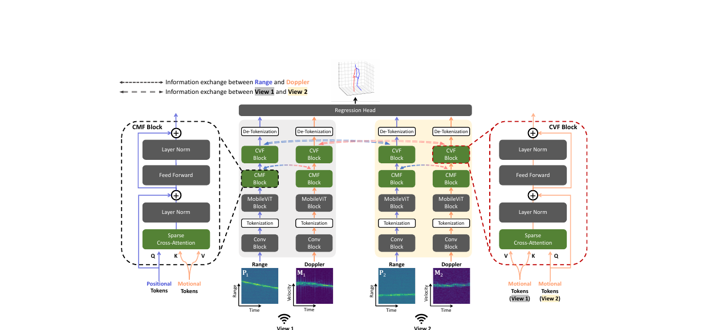
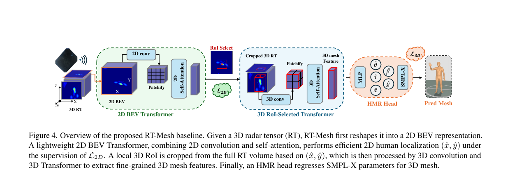
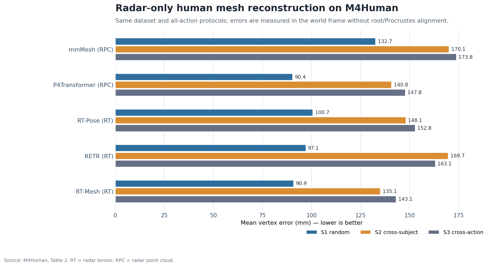

# Model Architecture Comparison: From RF-Pose to M4Human

## Technical summary

M4Human's RT-Mesh is best understood as a **coarse-to-fine, tensor-to-mesh model**. It keeps the dense 3D radar tensor (RT), compresses it to a bird's-eye-view representation only long enough to locate the person, crops the corresponding local 3D volume, and then reconstructs an SMPL-X mesh from that crop. This design avoids processing the entire 3D scene at full cost without discarding the local volumetric detail needed for a mesh.

The earlier works solve related but not identical problems:

- **RF-Pose and MMVR** learn 2D keypoint confidence maps from dense radar heatmaps.
- **mRI and MM-Fi** are primarily datasets; their radar pose results come from benchmark baselines operating on sparse radar point clouds.
- **mmMesh and Argus** convert sparse point-cloud sequences into parametric body meshes using explicit temporal modeling.
- **MVDoppler-Pose** fuses position and motion images from multiple radar views to estimate a 3D walking skeleton.
- **M4Human** moves to dense RT input, local 3D attention, SMPL-X output, and world-frame mesh evaluation.

Because the outputs and protocols differ, **AP, MPJPE, and MVE must not be used to rank all eight papers in one league table**. The only quantitative architecture comparison below uses methods retrained and evaluated on the same M4Human benchmark.

## The design evolution at a glance

The central trade-off is what survives radar preprocessing. Dense heatmaps preserve spatial structure but usually target 2D keypoints. CFAR point clouds are compact and convenient for point networks, but discard most sub-threshold voxels. Dense RT retains more of the return field, but requires an architecture that controls its much larger compute and memory cost.

*Generated synthesis of the eight works. Arrows show the dominant design progression, not a claim that every later paper directly derives from every earlier one.*

### A useful mental model

Read every radar pose architecture as five decisions:

1. **Representation:** heatmap, point cloud, range-Doppler image, or dense 3D tensor.
2. **Spatial encoder:** CNN, point network, Transformer, or a hybrid.
3. **Temporal/fusion mechanism:** temporal convolution, LSTM, cross-attention, or short-frame stacking.
4. **Body output:** 2D keypoints, 3D joints, SMPL, or SMPL-X.
5. **Metric:** OKS/AP for detected keypoints, MPJPE for joints, or MVE for mesh vertices.

## Side-by-side model comparison

| Work | What it contributes | Radar input used by the model | Main model design | Output | Appropriate result reading |
|---|---|---|---|---|---|
| **RF-Pose (2018)** | Through-wall 2D pose system | Horizontal and vertical RF heatmap sequences | Two spatiotemporal CNN encoders, concatenation, convolutional pose decoder; RGB teacher during training | 14 keypoint confidence maps | OKS/AP: detection quality over people and keypoints |
| **mmMesh (2021)** | Sparse-radar human mesh system | RPC points with position, range, Doppler velocity, and energy | Shared MLP, global attention + LSTM, anchor-based local grouping, local 3D CNN + LSTM, SMPL head | SMPL mesh, translation, gender | Vertex/joint/location errors: metric 3D reconstruction quality |
| **mRI (2022)** | Multimodal rehabilitation dataset and benchmark | 5D radar point clouds | Borrowed MARS-style convolutional radar baseline; no new flagship architecture | 3D joints in global coordinates | MPJPE/PA-MPJPE on mRI protocols |
| **MM-Fi (2023)** | Multimodal 4D human dataset and benchmark | About 0.5 s of aggregated radar points, each with \((x,y,z,d,I)\) | PointTransformer for single-radar pose; simple learned linear result fusion for multimodal baselines | 3D joints | MPJPE/PA-MPJPE on random, cross-subject, and cross-environment splits |
| **MMVR (2024)** | Multi-view high-resolution radar dataset | Horizontal and vertical radar heatmaps over four frames | RF-Pose extension with separate heatmap and part-affinity-field decoders | Multi-person 2D keypoints | AP/OKS; especially environment and multi-person generalization |
| **Argus (2025)** | Wearable egocentric mesh system | Two-view wearable radar point-cloud sequences | Multi-scale PointNet++, LSTM, KAN regression, upper-to-lower-body attention | SMPL body mesh | MVE for wearable, self-occluded reconstruction |
| **MVDoppler-Pose (2025)** | Multi-view, multi-modal walking-pose system | Range-time and Doppler/velocity-time images from two views | CNN + MobileViT streams; cross-modal then cross-view sparse attention | 3D joint sequence | MPJPE; robustness to distance, direction, and self-occlusion |
| **M4Human RT-Mesh (2026)** | Large radar HMR benchmark and tensor baseline | Four consecutive dense 3D RTs, each \(121\times111\times31\) | 2D BEV localization, local 3D RoI crop, 3D CNN + Transformer, HMR head | SMPL-X mesh, pose, shape, root orientation, translation, gender | World-frame MVE/MJE/MRE/TE under random, cross-subject, and cross-action splits |

## What M4Human changes

| Compared with | Earlier design intuition | M4Human's change | Why it matters |
|---|---|---|---|
| RF-Pose / MMVR | Project radar into two views and decode 2D heatmaps | Preserve a local 3D tensor and regress a complete SMPL-X body | Moves from visible keypoint detection to metric 3D shape, pose, and trajectory |
| mRI / MM-Fi | Apply CFAR and learn from a compact sparse RPC | Learn directly from dense RT before CFAR point selection | Retains weaker spatial evidence that may correspond to limbs or clothing |
| mmMesh / Argus | Recover missing evidence using point grouping and LSTM history | Localize globally in 2D, then model only a local 3D RoI with attention | Avoids full-volume 3D compute while preserving spatial detail around the person |
| MVDoppler-Pose | Fuse multiple position/motion views with cross-attention | Use one high-resolution volumetric representation and coarse-to-fine spatial selection | Trades extra sensors/views for richer per-frame 3D radar structure |

## 1. RF-Pose — dense projections to 2D keypoints

*Source figure excerpt: RF-Pose Figure 3. [Open-access paper](https://openaccess.thecvf.com/content_cvpr_2018/papers/Zhao_Through-Wall_Human_Pose_CVPR_2018_paper.pdf).*

**Pipeline:** horizontal/vertical RF heatmap sequences → two 3D spatiotemporal encoders → channel-wise concatenation → pose decoder → keypoint confidence maps.

The two radar views behave like very blurry side and top projections. Each view is encoded separately because its geometry is different. The decoder learns to transform their combined latent representation into the camera coordinate view. During training, a vision pose network produces supervision, but inference uses radar only.

The temporal window is essential: a single radar frame may miss a limb because RF reflection is specular. By observing many frames, the model learns recurring body dynamics and can infer a keypoint even when its instantaneous return is weak.

**Difference from M4Human:** RF-Pose intentionally ends at 2D confidence maps. RT-Mesh instead retains a local 3D volume and predicts a parametric 3D surface. A high AP from RF-Pose therefore does not mean lower 3D joint or vertex error.

## 2. mmMesh — sparse points, explicit body priors, and memory

*Source figure excerpt: mmMesh Figure 3. [Author-hosted paper](https://engineering.purdue.edu/~lusu/papers/MobiSys2021.pdf).*

**Pipeline:** sparse RPC → point-wise MLP → global attention + global LSTM → anchor-based local grouping → local 3D CNN + local LSTM → SMPL parameter head → mesh.

mmMesh addresses two losses caused by sparse radar preprocessing:

- **Missing spatial detail:** attention weights points by usefulness, while learned anchor points group nearby returns into body-part neighborhoods.
- **Missing body parts in a frame:** global and local LSTMs carry shape and pose information forward from previous frames.

The SMPL body model is a strong geometric prior. Rather than directly predicting thousands of unrelated vertices, the network predicts low-dimensional shape, joint rotation, translation, and gender parameters, then lets SMPL generate a valid body surface.

**Difference from M4Human:** mmMesh tries to reconstruct information after the radar has already been reduced to CFAR points. RT-Mesh starts earlier, before that aggressive sparsification, and controls cost through a learned RoI crop instead of relying primarily on recurrent completion.

## 3. mRI — a benchmark around a borrowed radar baseline

*Source figure excerpt: mRI Figure 1. [NeurIPS paper](https://proceedings.neurips.cc/paper_files/paper/2022/file/af9c9c6d2da701da5a0acf91ec217815-Paper-Datasets_and_Benchmarks.pdf).*

mRI is a **dataset paper**, not a new model family. Its radar benchmark uses the data-processing pipeline and convolutional model from MARS: a 5D radar point cloud is encoded to regress global 3D joints. The paper compares radar with RGB and wearable IMUs under random and cross-subject splits.

This makes mRI important for evaluation design: it exposes how modality quality changes between free-form movements and constrained rehabilitation movements. But its reported MPJPE should be attributed to the borrowed radar baseline on the mRI data, not to a model named “mRI.”

**Difference from M4Human:** mRI labels skeleton joints and benchmarks point-cloud pose. M4Human provides dense RT, RPC, MoCap-derived SMPL-X meshes, and global trajectories, enabling surface reconstruction rather than joint-only regression.

## 4. MM-Fi — PointTransformer baselines over a multimodal dataset

*Source figure excerpt: MM-Fi Figure 2. [NeurIPS paper](https://proceedings.neurips.cc/paper_files/paper/2023/file/3baf7a39d07e9f4f1e258a412df94521-Paper-Datasets_and_Benchmarks.pdf).*

MM-Fi is also primarily a **dataset and benchmark**. Its radar frames are sparse, so adjacent frames in a 0.5-second interval are aggregated to about 128 points. Each point is represented as position, Doppler velocity, and intensity: \((x,y,z,d,I)\).

For the radar-only 3D-pose baseline, the paper replaces the earlier MARS convolutional point model with a PointTransformer. For multimodal tests, independent predictions are combined through learned linear weights using a least-mean-square objective; this is result-level fusion, not deep token fusion.

**Difference from M4Human:** MM-Fi studies which sensor or sensor combination works for 3D joints. M4Human studies how much more human structure can be recovered when the radar representation and labels are rich enough for full HMR.

## 5. MMVR — RF-Pose extended for multi-person scenes

*Source figure excerpt: MMVR supplementary Figure 20. [ECCV paper and supplement](https://www.merl.com/publications/docs/TR2024-117.pdf).*

**Pipeline:** horizontal/vertical high-resolution heatmap sequences → RF-Pose-style spatiotemporal encoders → one decoder for joint heatmaps plus another for part affinity fields (PAFs) → multi-person 2D pose association.

MMVR's architecture change is driven by scene complexity. A confidence map can indicate where elbows or knees exist, but it does not say which elbow belongs to which person. PAFs encode the direction and association between connected body parts, allowing bottom-up multi-person grouping.

**Difference from M4Human:** MMVR emphasizes multiple people and unseen rooms using 2D AP. RT-Mesh assumes a localized human RoI and emphasizes single-person 3D mesh and translation accuracy. MMVR's high-resolution heatmaps nevertheless motivate the RETR tensor baseline adapted in the M4Human comparison.

## 6. Argus — wearable multi-view point clouds to SMPL

*Source figure excerpt: Argus Figure 14. [Author/arXiv paper](https://arxiv.org/pdf/2411.00419).*

**Pipeline:** two wearable radar views → velocity/energy/range point selection → upper- and lower-body PointNet++ encoders → temporal LSTMs → KAN regressors → body-part aggregation → SMPL mesh.

Egocentric sensing has a structural blind spot: radar worn near the torso receives stronger and cleaner evidence from the upper body than from the legs. Argus therefore predicts upper-body pose first and uses it as key/value context in an attention module for the lower-body stream. The model encodes a useful physical assumption: the upper and lower body are not independent during motion.

The camera shown in the system is used to generate pseudo-labels during training, not at inference. The deployed system uses the wearable radars.

**Difference from M4Human:** Argus optimizes for small, low-power, body-worn sensors and compensates for their viewpoint limitations with two views and body-hierarchy attention. RT-Mesh uses a fixed high-resolution radar and compensates for a large dense input with coarse-to-fine RoI processing.

## 7. MVDoppler-Pose — factor position, motion, and viewpoint

*Source figure excerpt: MVDoppler-Pose Figure 3. [CVPR open-access paper](https://openaccess.thecvf.com/content/CVPR2025/papers/Choi_MVDoppler-Pose_Multi-Modal_Multi-View_mmWave_Sensing_for_Long-Distance_Self-Occluded_Human_Walking_CVPR_2025_paper.pdf).*

**Pipeline:** range-time and Doppler/velocity-time images from two radar views → convolutional tokenization + MobileViT blocks → cross-modal fusion (position with motion in one view) → cross-view fusion (corresponding information across sensors) → 3D joint regression.

The factorization is physical rather than arbitrary:

- Range images are strongest for **where** a reflector is.
- Doppler images are strongest for **how** it is moving.
- A second view reduces direction-dependent signal loss and self-occlusion.

Sparse cross-attention selects only salient token relationships, avoiding the cost and noise amplification of dense all-to-all fusion. The loss combines position error with temporal motion consistency, which is particularly appropriate for periodic walking limbs.

**Difference from M4Human:** MVDoppler-Pose gains observability from multiple sensors and explicitly separated motion cues. M4Human gains observability from a dense 3D tensor, and its target is a full mesh plus global trajectory rather than a walking skeleton.

## 8. M4Human RT-Mesh — localize in 2D, reconstruct in local 3D

*Source figure excerpt: M4Human Figure 4. [CVPR open-access paper](https://openaccess.thecvf.com/content/CVPR2026/papers/Fan_M4Human_A_Large-Scale_Multimodal_mmWave_Radar_Benchmark_for_Human_Mesh_CVPR_2026_paper.pdf).*

**Pipeline:** four consecutive 3D RTs → collapsed 2D bird's-eye view → 2D convolution + self-attention → predicted \((x,y)\) center → local 3D RoI crop → 3D convolution + 3D self-attention → HMR head → SMPL-X mesh.

The two-stage design resolves a compute dilemma:

1. A full RT has rich spatial evidence but is too large for repeated full-volume 3D/4D processing.
2. Human localization does not initially need every elevation voxel, so the tensor can be collapsed to BEV.
3. Once the person center is known, only the corresponding local 3D crop needs expensive volumetric modeling.
4. The HMR head predicts body pose, shape, root orientation, global translation, and gender; SMPL-X converts those parameters into a coherent surface.

!!! note "What 'radar tensor' means here"
    M4Human's RT is a processed **3D intensity volume** in Cartesian \(X\)-\(Y\)-\(Z\) space, reconstructed from FFT-based radar processing. It is richer than the released CFAR point cloud, but it is not the original complex ADC/IQ stream. Therefore, it supports tensor/heatmap learning and spatial cropping, but it does not let you recover arbitrary complex phase that was not retained in the release.

## Same-benchmark result: what the architecture buys

The M4Human authors retrain or adapt radar-only HMR methods on the same data and protocols. This is the defensible place to compare architectures quantitatively. MVE is measured over all 10,475 SMPL-X vertices in the world frame, without root or Procrustes alignment; lower is better.

*Source data: M4Human Table 2. S1 is random split, S2 cross-subject, and S3 cross-action. These are the paper's retrained/adapted benchmark implementations, not a comparison of each method's original-paper headline number.*

### Interpretation

- **Random split:** P4Transformer is 90.4 mm and RT-Mesh is 90.9 mm. The 0.5 mm gap is tiny, and the table provides no uncertainty estimate, so it should not be treated as meaningful evidence that one is intrinsically better.
- **Cross-subject:** RT-Mesh is best at 135.1 mm, 5.7 mm below P4Transformer and 13.0 mm below RT-Pose.
- **Cross-action:** RT-Mesh is best at 143.1 mm, 4.7 mm below P4Transformer and 9.7 mm below RT-Pose.
- **Representation is not enough:** RETR also consumes RT, yet reaches 169.7 mm on S2. The dense tensor helps only when the architecture extracts the human region and manages clutter effectively.
- **The hard part is generalization:** every method degrades from S1 to S2/S3. M4Human's architecture reduces the degradation; it does not solve unseen subjects or unconstrained motion.

## Choosing a model design for a new project

- Use an **RF-Pose/MMVR-style heatmap decoder** when the output is 2D multi-person keypoints and AP/OKS is the operational metric.
- Use a **PointTransformer or point-network baseline** when storage, bandwidth, or embedded compute requires compact RPC input.
- Use an **mmMesh-style recurrent body prior** when sparse points and temporal continuity are central and the target is a mesh.
- Use an **Argus-style hierarchy** for wearable egocentric sensing, where upper- and lower-body observability is strongly asymmetric.
- Use **MVDoppler-style fusion** when multiple views and separate motion/position images are available, especially for walking.
- Use **RT-Mesh-style coarse-to-fine tensor processing** when dense M4Human RT is available and the goal is full SMPL-X reconstruction with global motion.

## Limitations and comparison cautions

- RF-Pose/MMVR AP, mRI/MM-Fi/MVDoppler MPJPE, and mmMesh/Argus/M4Human MVE answer different questions.
- Dataset scale, sensors, subject distance, action taxonomy, coordinate alignment, and train/test split change substantially across papers.
- mRI, MM-Fi, and MMVR introduce datasets and baseline suites; describing them as one novel “model” would be misleading.
- The source screenshots are figure excerpts from the cited papers. The design-evolution diagram and M4Human bar chart are generated syntheses for this page.
- The M4Human benchmark comparison is the strongest evidence here because it controls the dataset and protocols, but the table does not report repeated-run uncertainty.

## Primary sources

1. [RF-Pose — CVPR 2018](https://openaccess.thecvf.com/content_cvpr_2018/papers/Zhao_Through-Wall_Human_Pose_CVPR_2018_paper.pdf)
2. [mmMesh — MobiSys 2021](https://engineering.purdue.edu/~lusu/papers/MobiSys2021.pdf)
3. [mRI — NeurIPS 2022](https://proceedings.neurips.cc/paper_files/paper/2022/file/af9c9c6d2da701da5a0acf91ec217815-Paper-Datasets_and_Benchmarks.pdf)
4. [MM-Fi — NeurIPS 2023](https://proceedings.neurips.cc/paper_files/paper/2023/file/3baf7a39d07e9f4f1e258a412df94521-Paper-Datasets_and_Benchmarks.pdf)
5. [MMVR — ECCV 2024](https://www.merl.com/publications/docs/TR2024-117.pdf)
6. [Argus — SenSys 2025](https://arxiv.org/pdf/2411.00419)
7. [MVDoppler-Pose — CVPR 2025](https://openaccess.thecvf.com/content/CVPR2025/papers/Choi_MVDoppler-Pose_Multi-Modal_Multi-View_mmWave_Sensing_for_Long-Distance_Self-Occluded_Human_Walking_CVPR_2025_paper.pdf)
8. [M4Human — CVPR 2026](https://openaccess.thecvf.com/content/CVPR2026/papers/Fan_M4Human_A_Large-Scale_Multimodal_mmWave_Radar_Benchmark_for_Human_Mesh_CVPR_2026_paper.pdf)

For metric definitions and the separate accuracy tables, see the [Pose Metrics Reference](human_pose_metrics_reference.md) and [Accuracy Summary](selected_work_accuracy.md).
